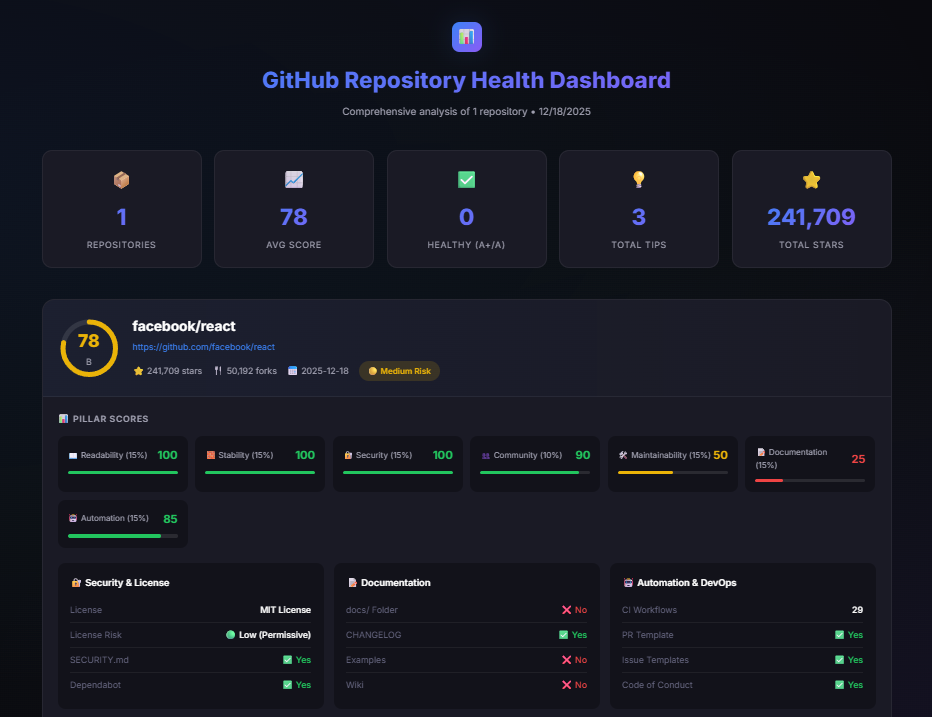

# GitHub Repository Health Analyzer 🏥

> **The "Credit Score" for Code** - Audit any GitHub repository and get a comprehensive Health Score (0-100) with actionable recommendations!

[](https://apify.com)
[](https://nodejs.org)
[](https://github.com)

## 🎨 Premium Visual Dashboard

**Click "Preview in new tab" or go to Storage → Key-Value Store → OUTPUT to see your results in a beautiful interactive dashboard!**



## 🎯 What Does This Actor Do?

This Actor analyzes GitHub repositories and generates a **Health Score (0-100)** based on **7 key pillars**:

| Pillar | Weight | What It Measures |
|--------|--------|------------------|
| 📖 **Readability** | 15% | README quality, documentation, description |
| 🧱 **Stability** | 15% | Releases, CI/CD, recent activity |
| 🔐 **Security** | 15% | License risk, SECURITY.md, Dependabot |
| 👥 **Community** | 10% | Stars, issue management, contribution guidelines |
| 🛠️ **Maintainability** | 15% | Tests, linter configuration |
| 📝 **Documentation** | 15% | docs/ folder, CHANGELOG, examples, wiki |
| 🤖 **Automation** | 15% | CI workflows, PR templates, issue templates |

## ✨ Key Features

- 🎨 **Premium Visual Dashboard** - Beautiful dark-themed HTML dashboard with animations
- 📊 **7-Pillar Analysis** - Comprehensive scoring across all dimensions
- 💡 **Actionable Recommendations** - Detailed tips with priority levels (Critical/Medium/Nice-to-have)
- 🏅 **Viral Badges** - Ready-to-use badges for your README
- 📱 **Responsive Design** - Dashboard works on mobile and desktop
- 🔄 **Profile Scanning** - Analyze all repos from a GitHub user/org

## 🚀 Use Cases

- **Developers**: Check library safety before `npm install`
- **CTOs/Agencies**: Audit contractor code quality
- **Recruiters**: Analyze candidate GitHub portfolios in seconds
- **Open Source Maintainers**: Track your project's health over time
- **Enterprise Teams**: Evaluate third-party dependencies

## 📥 Input Options

| Field | Type | Description | Default |
|-------|------|-------------|---------|
| `startUrls` | Array | GitHub repo URLs or user profile URLs | Required |
| `maxReposPerUser` | Integer | Max repos to scan per user | 10 |
| `githubToken` | String | Optional PAT for higher rate limits | null |
| `minHealthScore` | Integer | Filter results above this score | 0 |

### Example Input

```json
{
  "startUrls": [
    { "url": "https://github.com/facebook/react" },
    { "url": "https://github.com/apify" }
  ],
  "maxReposPerUser": 5,
  "minHealthScore": 50
}
```

### Input Modes

1. **Direct Mode**: Provide a repository URL to scan a single repo
   - Example: `https://github.com/vercel/next.js`

2. **Profile Mode**: Provide a user/org URL to scan all their repos
   - Example: `https://github.com/apify`

3. **Health Check Mode**: Run without input to test on `apify/crawlee`

## 📤 Output Tabs

Results are displayed in a **5-tab dashboard**:

| Tab | Content |
|-----|---------|
| 🏆 **Overview** | Score, Grade, Risk, Stars, Tips count |
| 💡 **Tips** | Actionable improvement suggestions |
| 📊 **Scores** | All 7 pillar scores breakdown |
| 📋 **Details** | License, Security, Dependabot, CI/CD |
| 🎨 **Dashboard** | Instructions to view visual dashboard |

### 🎨 Visual Dashboard

After each run, a premium HTML dashboard is generated. Access it via:
- **Storage → Key-Value Store → OUTPUT**

The dashboard includes:
- 📊 Animated score rings
- � 5-stat summary (Repos, Avg Score, Healthy, Tips, Stars)
- 📊 7 pillar progress bars with weighted percentages
- � Security & License details
- 📝 Documentation audit
- 🤖 Automation & DevOps status
- 💡 Numbered recommendations with Issue/Action/Impact

## 💡 Recommendation System

Each repository gets personalized recommendations:

```
1️⃣ � CRITICAL [Security]
   Issue: Missing SECURITY.md
   Action: Create SECURITY.md with vulnerability reporting guidelines
   Impact: Immediate action required - High impact on repository health

2️⃣ 🟡 MEDIUM [Documentation]  
   Issue: No examples folder
   Action: Add an examples/ directory with usage examples
   Impact: Recommended improvement - Moderate impact on score
```

## 🏅 Viral Badge Feature

Every scan generates a dynamic badge for your README:

```markdown
[-brightgreen?style=for-the-badge)](https://github.com/your/repo)
```

**Result:**

-brightgreen?style=for-the-badge)

## 📊 Health Score Grading

| Score | Grade | Risk Level |
|-------|-------|------------|
| 90-100 | A+ | 🟢 Low Risk |
| 80-89 | A | 🟢 Low Risk |
| 70-79 | B | 🟡 Medium Risk |
| 60-69 | C | 🟡 Medium Risk |
| 50-59 | D | 🟡 Medium Risk |
| 0-49 | F | 🔴 High Risk |

## ⚡ API Rate Limits

| Mode | Rate Limit | Best For |
|------|------------|----------|
| **Unauthenticated** | 60 requests/hour | Quick single-repo scans |
| **With Token** | 5,000 requests/hour | Bulk scans, user profiles |

To increase rate limits, provide a [GitHub Personal Access Token](https://github.com/settings/tokens) in the `githubToken` input field.

## 🔧 Technical Details

- **Runtime**: Node.js 20
- **Dependencies**: Apify SDK, Crawlee, Octokit
- **Analysis**: 7 pillars with weighted scoring
- **Output**: JSON data + HTML visual dashboard

## 💡 Tips

1. **Start with popular repos** to understand the scoring system
2. **Use the `minHealthScore` filter** to focus on quality repos
3. **Provide a GitHub token** for bulk scanning
4. **Check the Visual Dashboard** in Storage → Key-Value Store → OUTPUT
5. **Add the badge to your README** to showcase your project's health!

## 🆘 Support

If you encounter any issues or have suggestions, please open an issue on the Actor's page.

---

Made with ❤️ for the Apify Community
